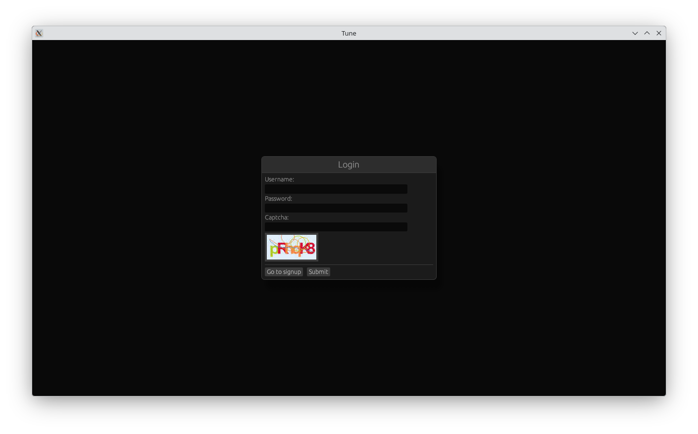
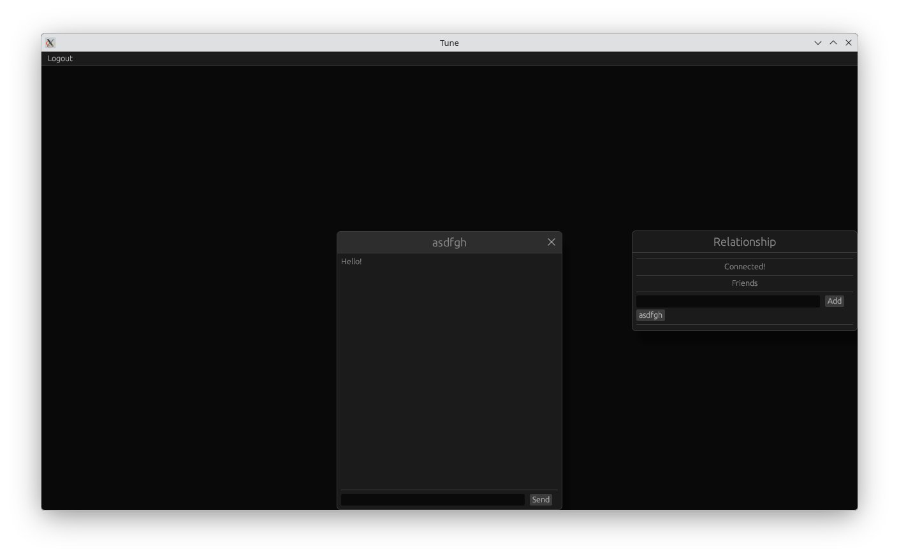

# Tune — Real-time Chat Client

Tune is a lightweight desktop chat client written in **Rust**, built on top of **egui**.

It is designed as a companion client for the [Counterpoint](https://github.com/symphire/counterpoint) chat server, focusing on:

- clean architecture and separation of concerns
- robust async networking behind a synchronous UI-facing API
- correct conversation history ordering under out-of-order delivery
- practical client-side state management without heavy frameworks

## Features

-   **Desktop UI client** built with `egui`
-   **Layered architecture** inspired by Elm-style message updates
-   **Synchronous Network Port** backed by an async Tokio runtime
-   **Request generation + cancellation** for all network tasks
-   **WebSocket streaming session** for realtime chat events
-   **Conversation reconciliation store** (offset-based merge, not append-only)
-   **ACK-based message delivery confirmation**

## Screenshots

### login



### chat with friends



## Project Structure

```
src/
├── app/        # top-level application state interface and messages
├── shell/      # eframe shell and arg parser
├── domain/     # domain value objects 
├── state/      # application state implementation + stores
├── port/       # networking interface
├── infra/      # networking (HTTP + WebSocket) implementation and runtime bridge
└── ui/         # pages (login/signup/lobby) and widgets
```

## Quick Start

- Copy the server-generated `dev_cert.pem` into the project root `certs/` directory (next to `src/`).
- `cargo run --package tune --bin tune`

## Architecture Overview

Tune is organized into four major layers:

### 1. UI Layer (`ui/`)

Pages such as:

-   Login
-   Signup
-   Lobby / Conversation view

UI components do not perform async work directly.  
Instead, they dispatch `AppMessage` events into the application state.

### 2. Application State (`state/`)

The core model is implemented in `RealAppState`.
It acts as a **resource registry**, managing async state slots such as:

-   captcha request state
-   login/signup state
-   friend list state
-   connection/session state

Each resource follows a lifecycle:

-   `prepare_*`
-   `drop_*`
-   `get_*`

This keeps page transitions explicit without requiring global GC.

### 3. Networking (`infra/network`)

Networking is exposed as a synchronous interface:

```Rust
pub trait Network {
    fn fetch_captcha(...callbacks...) -> Result<u64>;
    fn login(...callbacks...) -> Result<u64>;
    fn connect_chat(...stream callback...) -> Result<u64>;
}
```

All operations return a **generation id** (`u64`) so requests can be tracked or cancelled.

#### Async Runtime Bridge

`RealNetwork` internally runs a Tokio runtime thread:

-   UI calls remain synchronous
-   async futures execute in the background
-   results are sent back through callback dispatch

This design enables:

-   clean UI logic
-   language-agnostic callback interface (FFI-friendly)
-   restartable network workers without rebuilding the whole client

### 4. Conversation Store (Reconciliation Model)

Chat history is managed by `ConversationStore`.

Instead of simple append-only logs, Tune uses a merge-based approach:

-   messages may arrive from REST pulls, WS pushes, or ACK confirmations
-   ordering is determined by **server message offsets**
-   gaps ("holes") are detected and marked for resync

This ensures correct display even under:

-   out-of-order delivery
-   partial history loading
-   delayed acknowledgements
